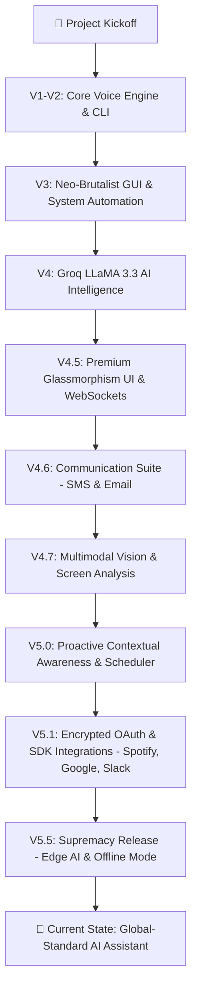

# 🔊 THING – AI Voice Assistant (Python + React)

**THING** is a high-end AI-powered voice assistant featuring a modern **React-based Web Interface** and a powerful **Python Backend**.
It performs system automation, plays music, fetches news, opens apps/websites, and can even **chat intelligently using Groq's cloud LLM models**.
The **V6.0 Full-Stack Upgrade** migrates all deprecated Groq models to `openai/gpt-oss-20b`, fixes the WhatsApp confirmation state loop, hardens the Spotify OAuth callback with URL-embedded state parameters, adds exponential backoff for failed OAuth token refresh, and introduces five new desktop pet animation states (`scrolling`, `typing`, `clicking`, `walking`, `walking_left`).
The V5.5 Supremacy Release introduced a complete Edge-AI offline fallback utilizing Ollama (Phi-3), seamlessly monitoring internet connectivity and switching inference completely to your local machine when offline.

This project demonstrates **AI integration, automation, voice recognition, and real-world assistant capabilities**.

---

# 🚀 Features by Phase

### ⚡ V6.0 — Full-Stack Fix & Upgrade
* **Groq Model Migration** – All 9 LLM call sites migrated from deprecated `llama-3.1-8b-instant` / `llama-3.3-70b-versatile` to `openai/gpt-oss-20b` via `.env` config vars (`GROQ_FAST_MODEL`, `GROQ_SMART_MODEL`).
* **Confirmation State Escape Hatch** – Sending a real command while in `WAIT_CONFIRMATION` (e.g., "scroll down" after a WhatsApp request) now cancels the pending action and executes the new command immediately.
* **30-Second Confirmation Timeout** – Pending actions (e.g., send WhatsApp) auto-cancel after 30 seconds if not confirmed, unblocking the assistant.
* **Spotify OAuth Hardening** – Service name embedded in OAuth `state` parameter so the callback works even after browser redirects clear the in-memory global.
* **OAuth Exponential Backoff** – Failed token refreshes (e.g., Notion 401) back off exponentially (2m → 4m → 8m → 30m max) instead of spamming every 15 seconds.
* **Desktop Pet New States** – `typing`, `clicking`, `scrolling` animations with automatic 4–6s revert. 300ms state debounce eliminates flickering.
* **VoiceOrb State Sync** – All server states (`scrolling`, `thinking`, `typing`, `clicking`) correctly map to visual orb states.
* **Chat History Persistence** – Last 20 conversations restored on page reload via `conversation_history` WebSocket event.
* **Fuzzy Typo Correction** – Entity resolver now handles 40+ common typos + `difflib` fuzzy matching as fallback.
* **Hallucination Guard Skip** – Regex-matched direct actions skip the LLM guard call, reducing latency by ~600ms.

### 🔌 V5.5 — Supremacy Release (Edge AI & Offline Mode)
* **Local Fallback Inference** – Auto-switches to Ollama (Phi-3) when offline, allowing THING to process commands entirely without an internet connection.
* **Connectivity Engine** – Intelligent daemon that automatically handles network transitions and limits capabilities gracefully (e.g. telling you it can't reach Spotify if offline).

### 🌐 V5.1 — Encrypted OAuth & SDK Integrations
* **Encrypted OAuth Dashboard** – Connect third-party services securely. Tokens are stored encrypted via Fernet symmetric encryption and auto-refreshed transparently.
* **Spotify SDK Integration** – Full voice-controlled playback (play tracks/playlists, pause, resume, skip, previous, and adjust volume) using native API endpoints (no browser).
* **Google Calendar Integration** – Voice-controlled calendar query interface (events today, tomorrow, or this week) and direct event creation.
* **Slack Workspace Integration** – List public channels, read recent message histories (resolving user IDs to display names), and post messages directly to channels.

### 🧠 V5.0 — Proactive Contextual Awareness & Scheduler
* **Proactive Observer** – Background observations thread (`context_observer.py`) monitoring OS thresholds (CPU/RAM load), active productivity tools (Zoom, Teams, Discord), and clipboard state to trigger proactive context cards.
* **Dynamic Scheduler** – Time-sensitive task management (e.g. End-of-Day summary prompts) integrated with settings.

### 📹 V4.8 — Live Video Visor & Facial Recognition
* **Futuristic Webcam Visor** – Live camera stream with neon laser visual sweeping and automated backend lock release.
* **Stateful Facial Registration** – Facial scan registration that remembers names and greets registered users.

### 👁️ V4.7 — Multimodal Vision & Screen Analysis
* **Gemini Vision Processing** – Capture active screen frames, summarize documents, read console errors, and perform click actions using Gemini coordinate detection.

### 💬 V4.6 — Communication Suite (SMS & Email)
* **Email & SMS Review Cards** – Draft and preview emails or SMS messages with interactive review cards in the browser before sending.

### 🌌 V4.5 — Premium UI & Animated Desktop Pet
* **Interactive Desktop Pet** – A dynamic, animated companion (using GIF and PNG assets) that reflects the assistant's current state (idle, listening, thinking, speaking, typing, etc.).
* **Glassmorphism Web UI** – Ultra-responsive front-end dashboard styled with React, Tailwind CSS, and Framer Motion.
* **Real-time WebSockets** – Socket.io interface for instantaneous, two-way status updates and message synchronization.

### 🤖 V4.0 — Groq LLaMA 3.3 AI Chat
* **Intelligent Conversation** – Powered by LLaMA 3.3 for conversational planning, pronoun resolution, and complex action execution.

### ⚙️ V3.0 — GUI & System Automation
* **System Automation** – OS-level volume, brightness, screenshots, screen lock, and power state controls.
* **App Launcher** – Open common desktop applications and websites instantly.
* **Memory Database** – Dynamic fact storage (`memory.json`) that updates and recalls user preference details.

### 🎙️ V1 - V2 — Core Voice Engine & CLI
* **Voice Commands** – Handled via SpeechRecognition with native text-to-speech output.
* **Interrupt Engine** – Stop the assistant's voice readout immediately at any time.
* **Live News Updates** – Fetch and read top global news headlines.

---

# 📈 Development Workflow



---

# 🧠 Technologies Used

| Technology                | Purpose                       |
| ------------------------- | ----------------------------- |
| Python 3.10+              | Core Backend Engine           |
| FastAPI & WebSockets      | API and real-time streaming   |
| React & Vite              | High-performance Frontend     |
| Tailwind CSS & Framer     | Styling and UI Animations     |
| SpeechRecognition         | Voice input processing        |
| Groq API (LLaMA 3.3)      | AI conversation & planning    |
| PyAutoGUI                 | System automation             |
| Playwright                | Web automation                |
| pywin32                   | Windows window management     |
| Spotipy                   | Spotify API SDK Integration   |
| Slack SDK                 | Slack API Workspace Integration|
| Google API Python Client  | Google Calendar API Integration|

---

# 📁 Project Structure

```
THING/
│
├── backend/             # Python FastAPI backend & AI logic
│   ├── core/            # Server, scheduler, context observer, suggestion engine
│   ├── engine/          # Intent routing, LLM classification, and local LLM fallback
│   ├── modules/         # Integrations (Vision, UI, YouTube, WhatsApp, SMS)
│   └── data/            # Memory and intent schemas
│
├── frontend/            # React + Vite web interface
│   ├── src/
│   │   ├── components/  # Chat window, Voice Orb, Settings
│   │   ├── hooks/       # WebSocket communication
│   │   └── assets/      # Media files
│   └── package.json     # Node dependencies
│
├── README.md            # Project documentation
└── .env                 # Environment variables
```

---

# ⚙️ Installation & Setup

## 1️⃣ Clone the Repository

```bash
git clone https://github.com/your-username/THING.git
cd THING
```

---

## 2️⃣ Create Virtual Environment

```bash
python -m venv venv
```

Activate the environment:

### Windows

```bash
venv\Scripts\activate
```

### Mac / Linux

```bash
source venv/bin/activate
```

---

## 3️⃣ Install Dependencies

```bash
pip install -r requirements.txt
```

---

## 4️⃣ Set Groq API Key (IMPORTANT)

Create an environment variable:

### Windows (PowerShell)

```bash
setx GROQ_API_KEY "your_api_key_here"
```

After setting the key, **restart the terminal**.

---

# ▶️ Run the Assistant

```bash
python main.py
```

Then say:

> **"Hey Thing"**

or type commands directly in the terminal 🎧

---

# 🔌 OAuth Integrations Setup (v5.1)

THING integrates with external APIs using a secure local loopback OAuth callback handler. To set up your connections:

1. Open your developer console for the respective service.
2. Register the following **Redirect URI / Callback URL** exactly:
   * **Spotify**: `http://127.0.0.1:5000/oauth/callback`
   * **Google, Microsoft, Notion, Slack**: `http://localhost:5000/oauth/callback`
3. Add your client credentials to your local `.env` file (see `.env.example` for details).
4. Run the assistant backend and frontend:
   - Backend: `python main.py`
   - Frontend: `cd frontend && npm run dev`
5. Open THING Web UI, go to **Integrations**, and click **Connect** for Spotify, Google Calendar, Slack, Microsoft, or Notion.

*For detailed troubleshooting instructions on setting up each developer portal, see [oauth_fixes_needed.md](file:///c:/Users/prabh/OneDrive/Documents/GitHub/THING-Voice-Assistant/oauth_fixes_needed.md).*

---

# 🛡️ Security Note

* API keys are **never hardcoded**
* `.env` and virtual environments are **ignored using `.gitignore`**
* Safe to upload and share on **public GitHub repositories**

---

# 👨‍💻 Author

**Prabhu Shankar Mund (Raj)**
🎓 BCA Student
🐍 Python Developer
🤖 AI & Automation Enthusiast

---

# ⭐ Final Note

This project focuses on **real-world AI automation and voice control systems**.

---

# 🏆 THING vs. Industry Giants (Google & Alexa)

How does **THING** compare to the world's most popular assistants? 

| Feature | THING | Google / Alexa |
| :--- | :--- | :--- |
| **Desktop Control** | Deep (.exe, Windows API) | None / Restricted |
| **Automation** | Playwright & PyAutoGUI | Official APIs Only |
| **Privacy** | 100% Local Logic | Cloud-based |
| **Customization** | Infinite (Python) | Limited (Skills/Actions) |

> [!TIP]
> **Check out the [Detailed Comparison Analysis](THING_vs_Google_Alexa.md)** to see how THING reaches a "Pro-User Jarvis Level" of software control.

---

If you like this project:

⭐ Star the repository
🍴 Fork the project
💡 Suggest improvements

---

**THING – Your Personal AI Assistant Powered by Python 🚀**

