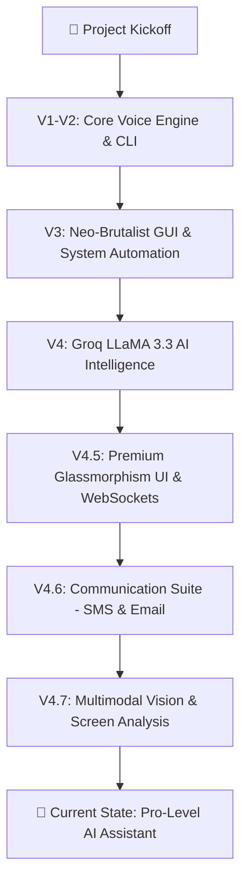

# 🔊 THING – AI Voice Assistant (Python + React)

**THING** is a high-end AI-powered voice assistant featuring a modern **React-based Web Interface** and a powerful **Python Backend**.
It performs system automation, plays music, fetches news, opens apps/websites, and can even **chat intelligently using Groq's LLaMA model**.
The new V4.7 upgrade introduces a powerful Multimodal Vision Engine, stunning glassmorphism UI, and WebSocket-based real-time communication.

This project demonstrates **AI integration, automation, voice recognition, and real-world assistant capabilities**.

---

# 🚀 Features

* 🎙️ **Voice & Text Commands** – Control the assistant using voice or the modern web input bar
* 🌌 **Premium Web UI** – Beautiful, responsive glassmorphism interface built with React & Tailwind CSS
* ⚡ **Real-Time Communication** – WebSockets for instantaneous, two-way interaction
* 🤖 **AI Chat (Groq LLaMA 3.3)** – Smart conversation, complex action planning, and email drafting
* 🎵 **Music Playback** – Plays songs directly from YouTube
* 🌐 **Open Websites & Applications** – Launch common tools instantly
* 💬 **Communication Suite** – Send SMS and draft emails with a premium review interface
* 👁️ **Multimodal Vision (v4.7)** – Describe your screen, read errors, summarize docs, and even **click UI elements** visually
* 🔊 **System Control** – Volume, brightness, screenshot, and system power management
* 🧠 **Memory System** – Stores and recalls important information dynamically
* 📰 **Live News Updates** – Fetches latest news using APIs
* 📷 **Camera Access** – Open and control webcam
* 🛑 **Interrupt System** – Stop the assistant while it is speaking

---

# 📈 Development Workflow



---

# 🧠 Technologies Used

| Technology                | Purpose                       |
| ------------------------- | ----------------------------- |
| Python 3.10+              | Core Backend Engine           |
| FastAPI & WebSockets      | API and real-time streaming   |
| React & Vite              | High-performance Frontend     |
| Tailwind CSS & Framer     | Styling and UI Animations     |
| SpeechRecognition         | Voice input processing        |
| Groq API (LLaMA 3.3)      | AI conversation & planning    |
| PyAutoGUI                 | System automation             |
| Playwright                | Web automation                |
| pywin32                   | Windows window management     |

---

# 📁 Project Structure

```
THING/
│
├── backend/             # Python FastAPI backend & AI logic
│   ├── core/            # Server, audio, and pipeline
│   ├── engine/          # Intent routing and action planning
│   ├── modules/         # Integrations (YouTube, Email, WhatsApp, SMS)
│   └── data/            # Memory and intent schemas
│
├── frontend/            # React + Vite web interface
│   ├── src/
│   │   ├── components/  # Chat window, Voice Orb, Settings
│   │   ├── hooks/       # WebSocket communication
│   │   └── assets/      # Media files
│   └── package.json     # Node dependencies
│
├── README.md            # Project documentation
└── .env                 # Environment variables
```

---

# ⚙️ Installation & Setup

## 1️⃣ Clone the Repository

```bash
git clone https://github.com/your-username/THING.git
cd THING
```

---

## 2️⃣ Create Virtual Environment

```bash
python -m venv venv
```

Activate the environment:

### Windows

```bash
venv\Scripts\activate
```

### Mac / Linux

```bash
source venv/bin/activate
```

---

## 3️⃣ Install Dependencies

```bash
pip install -r requirements.txt
```

---

## 4️⃣ Set Groq API Key (IMPORTANT)

Create an environment variable:

### Windows (PowerShell)

```bash
setx GROQ_API_KEY "your_api_key_here"
```

After setting the key, **restart the terminal**.

---

# ▶️ Run the Assistant

```bash
python main.py
```

Then say:

> **"Hey Thing"**

or type commands directly in the terminal 🎧

---

# 🛡️ Security Note

* API keys are **never hardcoded**
* `.env` and virtual environments are **ignored using `.gitignore`**
* Safe to upload and share on **public GitHub repositories**

---

# 👨‍💻 Author

**Prabhu Shankar Mund (Raj)**
🎓 BCA Student
🐍 Python Developer
🤖 AI & Automation Enthusiast

---

# ⭐ Final Note

This project focuses on **real-world AI automation and voice control systems**.

---

# 🏆 THING vs. Industry Giants (Google & Alexa)

How does **THING** compare to the world's most popular assistants? 

| Feature | THING | Google / Alexa |
| :--- | :--- | :--- |
| **Desktop Control** | Deep (.exe, Windows API) | None / Restricted |
| **Automation** | Playwright & PyAutoGUI | Official APIs Only |
| **Privacy** | 100% Local Logic | Cloud-based |
| **Customization** | Infinite (Python) | Limited (Skills/Actions) |

> [!TIP]
> **Check out the [Detailed Comparison Analysis](THING_vs_Google_Alexa.md)** to see how THING reaches a "Pro-User Jarvis Level" of software control.

---

If you like this project:

⭐ Star the repository
🍴 Fork the project
💡 Suggest improvements

---

**THING – Your Personal AI Assistant Powered by Python 🚀**

