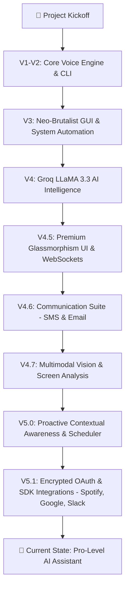

# 🔊 THING – AI Voice Assistant (Python + React)

**THING** is a high-end AI-powered voice assistant featuring a modern **React-based Web Interface** and a powerful **Python Backend**.
It performs system automation, plays music, fetches news, opens apps/websites, and can even **chat intelligently using Groq's LLaMA model**.
The new V5.1 upgrade introduces an Encrypted OAuth Integrations Dashboard, full voice-controlled Spotify SDK integration, Google Calendar scheduling, Slack workplace communication, Proactive Contextual Awareness, and zero-latency local intent routing.

This project demonstrates **AI integration, automation, voice recognition, and real-world assistant capabilities**.

---

# 🚀 Features

* 🎙️ **Voice & Text Commands** – Control the assistant using voice or the modern web input bar.
* 🌌 **Premium Web UI** – Beautiful, responsive glassmorphism dashboard built with React, Tailwind CSS, and Framer Motion.
* 🔌 **Encrypted OAuth Integrations (v5.1)** – Connect third-party services securely. Features voice-controlled Spotify playback (search tracks/playlists, volume, controls), Google Calendar queries/event creation, and Slack workspace communication, all authorized through a secure, encrypted frontend dashboard.
* ⚡ **Real-Time Communication** – Socket.io WebSockets for instantaneous, zero-latency, two-way interaction.
* 🤖 **AI Chat (Groq LLaMA 3.3)** – Smart conversations, multi-step action planning, pronoun resolution, and contextual drafts.
* 🎵 **Music Playback** – Search and play songs directly from YouTube or control Spotify natively.
* 🌐 **Open Websites & Applications** – Launch common tools and websites instantly.
* 💬 **Communication Suite** – Send SMS and draft emails with a premium review card interface before sending.
* 👁️ **Multimodal Vision (v4.7)** – Capture screens, summarize documents, read code errors, and visually click UI elements using Gemini Vision coordinates.
* 🧠 **Proactive Contextual Awareness (v5.0)** – Background observation thread (`context_observer.py`) monitoring CPU/RAM thresholds, active productivity apps (Zoom, Teams, Discord), and clipboard URLs to offer smart toast notifications.
* 📅 **Dynamic Scheduler** – Time-based event scheduling (such as configurable End-of-Day checks) integrated with leak prevention and settings.
* 📹 **Futuristic Live Video Visor (v4.8)** – Real-time dashboard webcam streaming with neon laser sweeps, custom styling, automatic lock release for backend AI vision queries, and stateful facial registration (remembers users).
* 🔊 **System Control** – OS-level volume, brightness, screenshots, lock screen, and power state controls.
* 🧠 **Memory Database** – Stores, recalls, and updates facts about users dynamically (`memory.json`).
* 📰 **Live News Updates** – Fetches and speaks the latest news articles.
* 🛑 **Interrupt System** – Immediately stop the assistant's voice playback while it is speaking.

---

# 📈 Development Workflow



---

# 🧠 Technologies Used

| Technology                | Purpose                       |
| ------------------------- | ----------------------------- |
| Python 3.10+              | Core Backend Engine           |
| FastAPI & WebSockets      | API and real-time streaming   |
| React & Vite              | High-performance Frontend     |
| Tailwind CSS & Framer     | Styling and UI Animations     |
| SpeechRecognition         | Voice input processing        |
| Groq API (LLaMA 3.3)      | AI conversation & planning    |
| PyAutoGUI                 | System automation             |
| Playwright                | Web automation                |
| pywin32                   | Windows window management     |
| Spotipy                   | Spotify API SDK Integration   |
| Slack SDK                 | Slack API Workspace Integration|
| Google API Python Client  | Google Calendar API Integration|

---

# 📁 Project Structure

```
THING/
│
├── backend/             # Python FastAPI backend & AI logic
│   ├── core/            # Server, scheduler, context observer, suggestion engine
│   ├── engine/          # Intent routing, LLM classification, and state management
│   ├── modules/         # Integrations (Vision, UI, YouTube, WhatsApp, SMS)
│   └── data/            # Memory and intent schemas
│
├── frontend/            # React + Vite web interface
│   ├── src/
│   │   ├── components/  # Chat window, Voice Orb, Settings
│   │   ├── hooks/       # WebSocket communication
│   │   └── assets/      # Media files
│   └── package.json     # Node dependencies
│
├── README.md            # Project documentation
└── .env                 # Environment variables
```

---

# ⚙️ Installation & Setup

## 1️⃣ Clone the Repository

```bash
git clone https://github.com/your-username/THING.git
cd THING
```

---

## 2️⃣ Create Virtual Environment

```bash
python -m venv venv
```

Activate the environment:

### Windows

```bash
venv\Scripts\activate
```

### Mac / Linux

```bash
source venv/bin/activate
```

---

## 3️⃣ Install Dependencies

```bash
pip install -r requirements.txt
```

---

## 4️⃣ Set Groq API Key (IMPORTANT)

Create an environment variable:

### Windows (PowerShell)

```bash
setx GROQ_API_KEY "your_api_key_here"
```

After setting the key, **restart the terminal**.

---

# ▶️ Run the Assistant

```bash
python main.py
```

Then say:

> **"Hey Thing"**

or type commands directly in the terminal 🎧

---

# 🔌 OAuth Integrations Setup (v5.1)

THING integrates with external APIs using a secure local loopback OAuth callback handler. To set up your connections:

1. Open your developer console for the respective service.
2. Register the following **Redirect URI / Callback URL** exactly:
   ```text
   http://127.0.0.1:5000/oauth/callback
   ```
3. Add your client credentials to your local `.env` file (see `.env.example` for details).
4. Run the assistant backend and frontend:
   - Backend: `python main.py`
   - Frontend: `cd frontend && npm run dev`
5. Open THING Web UI, go to **Integrations**, and click **Connect** for Spotify, Google Calendar, Slack, Microsoft, or Notion.

*For detailed troubleshooting instructions on setting up each developer portal, see [oauth_fixes_needed.md](file:///c:/Users/prabh/OneDrive/Documents/GitHub/THING-Voice-Assistant/oauth_fixes_needed.md).*

---

# 🛡️ Security Note

* API keys are **never hardcoded**
* `.env` and virtual environments are **ignored using `.gitignore`**
* Safe to upload and share on **public GitHub repositories**

---

# 👨‍💻 Author

**Prabhu Shankar Mund (Raj)**
🎓 BCA Student
🐍 Python Developer
🤖 AI & Automation Enthusiast

---

# ⭐ Final Note

This project focuses on **real-world AI automation and voice control systems**.

---

# 🏆 THING vs. Industry Giants (Google & Alexa)

How does **THING** compare to the world's most popular assistants? 

| Feature | THING | Google / Alexa |
| :--- | :--- | :--- |
| **Desktop Control** | Deep (.exe, Windows API) | None / Restricted |
| **Automation** | Playwright & PyAutoGUI | Official APIs Only |
| **Privacy** | 100% Local Logic | Cloud-based |
| **Customization** | Infinite (Python) | Limited (Skills/Actions) |

> [!TIP]
> **Check out the [Detailed Comparison Analysis](THING_vs_Google_Alexa.md)** to see how THING reaches a "Pro-User Jarvis Level" of software control.

---

If you like this project:

⭐ Star the repository
🍴 Fork the project
💡 Suggest improvements

---

**THING – Your Personal AI Assistant Powered by Python 🚀**

